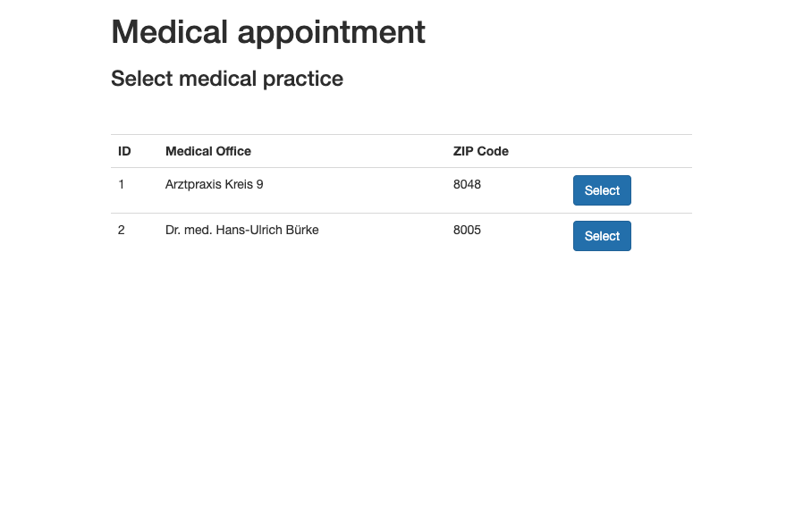

# PatientZero

### Simple Starter Project using:
- Flask, (lightweight web application framework) https://palletsprojects.com/p/flask/
- Jinja (full-featured template engine for Python) https://palletsprojects.com/p/jinja/
- Flask-Bootstrap: https://pythonhosted.org/Flask-Bootstrap/
- pymysql

### Tutorials:
- Using Flask on Python 3 with MySQL: https://sweetcode.io/flask-python-3-mysql/

### About the Starter Project

The Starter Project shows how to 
- add routs, 
- use the template engine
- and connect to a mysql db.

